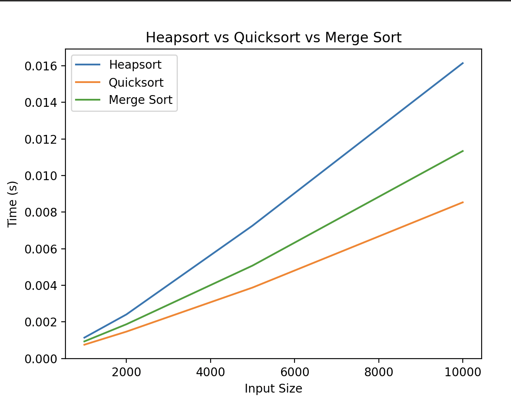
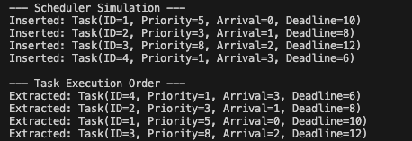

Heapsort:

-The time complexity of heapsort is o(n) + O(n log n) = O(n log n)

Analysis:

For each node in the heap, the cost of heapify depends on the height of the node. In a heap size of n, the height of the tree is log n.
The total time to build heap is T_build = Σ (number of nodes at height i) × (heapify cost at height i), where i = 1 to h,
Which simplifies to O(n).

Worst Case: In this worst-case scenario. For instance, in reverse-sorted input, the heap-building step follows the same O(n) and O(n log n) complexity respectively.

Average Case: In the average case scenario, time complexity remains the same as the head operation depends only on the tree structure.
Best Case: If the input array is already sorted, the algorithm builds heap and performs n01 heapify which results in O(n log n) complexity.

Space Complexity: 
Since heapsort is an in-place sorting algorithm. It does not require additional memory as with the input size. So it uses the array to serve as a heap. The space complexity is O(1). In summary, the time complexity of the building heap is O(n), sorting heap is O(n log n).

Recursive Calls: 
The recursive implementation of Heapify uses stack space proportional to the height of the tree which is O(log n). To avoid this, an iteration of heapify can be used.

Empirical Comparison:

On the input size of 
input_sizes = [10**3, 2 * 10**3, 5 * 10**3, 10**4]

Observation: 
1. The running time of all three algorithms Heapsort, Quicksort, and Merge Sort increases as the input size grows, which results in the complexity of O(n log n).
2. Quick sort performs the best among the three algorithms in terms of runtime for larger input sizes. Whereas Merge sort is slower than quick short but faster than the Heapsort. More detailed findings are as follows:

Why did Quicksort perform the fastest?
-> Due to better cache efficiency which accesses memory more sequentially compared to tree-like structure of Heapsort.

Why Merge Sort is slower than Quicksort?
-> Merge Sort requires additional memory O(n) which slows it down

Why Heapsort is the slowest?
-> Heapsort frequently accesses non-contiguous memory locations because of the tree structure.
-> Heapsort involves more swaps compared to the other two algorithms.

Priority Queue Implementation and Applications

Data Structure: 
-A binary heap is used.
-Python’s heapq module is used for managing binary heap efficiently.

The Task class stores:
•Task ID (task_id)

•Priority (priority)

•Arrival Time (arrival_time)

•Deadline (deadline)

I am going to use min-heap (lowest priority first) prioritizing tasks with the smallest value since many of the scheduling algorithms use tasks with the smallest value.

Core Operation:

insert(self, task): Adds new task into the heap and insertion takes O(log n) as the element to maintain the heap property.

Implementation:
def insert(self, task):

heapq.heappush(self.heap, task)

extract_min(): Removes and returns the task with the lowest priority which makes the complexity O (log n) as the heap is restructured.

Implementation:
extract_min(self):
    return heapq.heappop(self.heap) if not self.is_empty() else None

decrease_key(self, task_id, new_priority): Finds a task and updates its priority. The time complexity is as follows:
-Linear Search: O(n)
-Adjusting heap: O(log n)

Implementation: 
def decrease_key(self, task_id, new_priority):
 for i, task in enumerate(self.heap):
        if task.task_id == task_id and new_priority < task.priority:
            self.heap[i].priority = new_priority
            heapq.heapify(self.heap)

is_empty(self): Checks if the heap is empty where the time complexity is O(1)

Implementation:
def is_empty(self):
  return len(self.heap) == 0

Scheduling Results:

The min-heap priority queue ensures that tasks are executed with the lowest priority first. The resulting execution order is:
    1.Task(ID=4): Priority = 1

2.Task(ID=2): Priority = 3

3.Task(ID=1): Priority = 5

4.Task(ID=3): Priority = 8

Analysis:

The task with the lowest value is executed first. For example, Task(ID=4) arrived last yet it was executed first due to its highest priority.

After every insertion or extraction, the binary heap adjusts itself to maintain heap property.
After Task(ID=4) is inserted, it becomes the root of the heap
After Task(ID=4) is extracted, Task(ID=2) becomes new root due to its priority of 3

The min_heap ensures efficiency in scheduling tasks with a complexity of O(log n) for each operation

Tasks are processed based on their priority value using a min-heap-based priority queue which efficiently results in the complexity of O(log n) on every operation.

